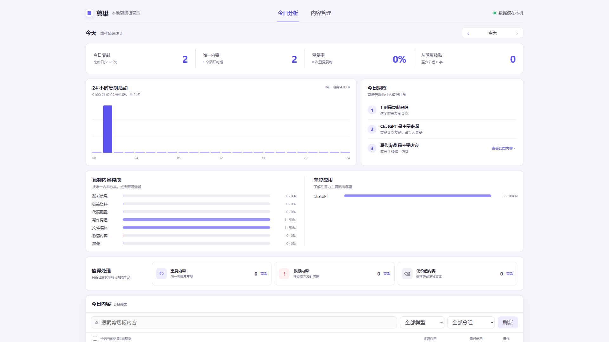
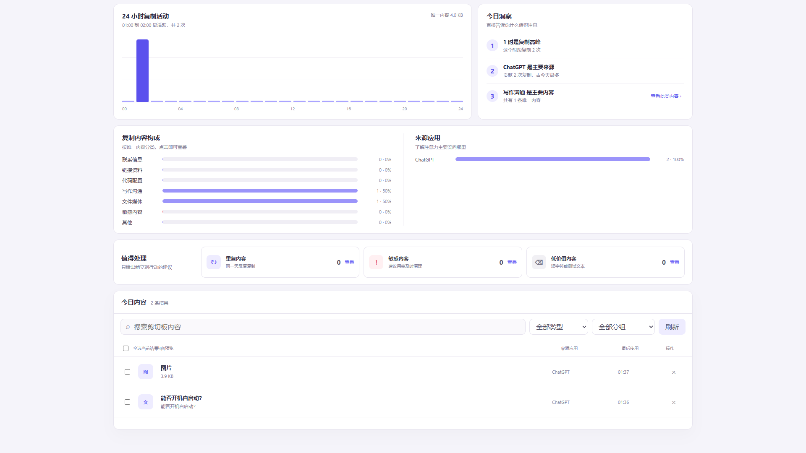
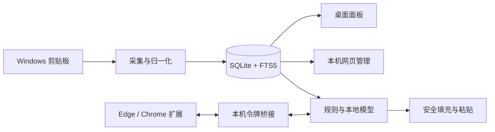

<div align="center">
  

  <h1>剪巢 ClipNest</h1>

  <p><strong>本地优先的 Windows 智能剪贴板</strong></p>
  <p>让复制过的内容自动归巢，需要时快速找到，并安全地填入网页表单。</p>

  <p>
    
    
    
    
    
  </p>
</div>

## 为什么是剪巢

普通剪贴板只记住“刚才复制了什么”。剪巢会把内容保存在本机，自动去重、分类和建立索引，让它们能够被再次搜索、整理和使用。

它不仅是一份历史记录，也是一套完整的本地工作流：

- 复制文本、链接、图片、文件和文件夹后自动收集。
- 重复内容不会反复占用空间，只会更新最近使用时间和使用次数。
- 通过快捷键、搜索、分组和顺序队列快速粘贴。
- 在本机网页管理页查看每日复制情况并清理无用内容。
- 通过 Edge 或 Chrome 扩展识别表单字段，自动填充或展示候选。
- 所有剪贴板数据与模型推理默认留在当前设备。

## 核心能力

| 能力 | 说明 |
|---|---|
| 自动收集 | 仅在 Windows 剪贴板发生变化时读取内容，支持文本、链接、图片、文件和文件夹 |
| 内容去重 | 使用内容哈希复用已有记录，重复复制只更新热度与最近使用时间 |
| 快速搜索 | 基于 SQLite FTS5 的本地全文搜索，长时间使用仍保持稳定分页性能 |
| 快捷粘贴 | 支持全局呼出、数字快捷粘贴与最多 9 项的顺序粘贴队列 |
| 智能分组 | 根据来源应用、域名、文件扩展名和时间条件自动整理 |
| 网页管理 | 在本机浏览器中查看趋势、分类、来源、重复率并批量删除内容 |
| 智能填充 | 根据字段含义选择邮箱、主页、电话、公司等内容，单一高置信候选可直接填入 |
| 动态候选 | 多候选会根据当前输入实时收敛，并明确区分字段相关结果与全库候选 |
| 本地模型 | 可选 BGE Small 中文模型与 MiniLM 多语言模型，下载后完全离线推理 |
| 安全规则 | 密码字段永远不上报、永远不填充；已有输入不会被无提示覆盖 |

## 产品界面

### 每日复制分析

网页版管理页提供复制次数、唯一内容、重复率、粘贴次数、活跃时段、内容分类、主要来源和清理建议。服务仅监听本机地址。



### 内容管理

可以搜索全部历史，按类型和分组筛选，查看来源与最近使用时间，并删除单项或批量清理。



### 浏览器智能填充

浏览器扩展通过本机 WebSocket 与桌面端通信。启用后会自动重连，令牌校验失败时会明确显示错误，不会静默切换连接方式。

<table>
  <tr>
    <td width="50%"></td>
    <td width="50%"></td>
  </tr>
  <tr>
    <td align="center">本机桥接、令牌与自动填充</td>
    <td align="center">规则匹配、本地模型与置信阈值</td>
  </tr>
</table>

## 安装与运行

### 系统要求

- Windows 11 x64
- Node.js 22 或更高版本，仅源码开发需要
- Edge 或 Chrome，仅浏览器智能填充需要

### 使用安装包

正式构建会在 `release/` 中生成两个版本：

- `ClipNest-Setup-0.1.0-x64.exe`：安装版，可选择安装目录并创建快捷方式。
- `ClipNest-Portable-0.1.0-x64.exe`：便携版，无需安装即可运行。

### 从源码运行

```powershell
npm install
npm run dev
```

构建 Windows 成品：

```powershell
npm run dist:win
```

项目不使用 Docker，所有依赖均在 Windows 原生环境运行。

## 基本使用

1. 启动剪巢后正常复制内容，记录会自动进入剪贴板面板。
2. 使用全局快捷键呼出面板，输入关键词或选择分组。
3. 点击内容即可粘贴到原窗口，也可以使用数字快捷键快速粘贴。
4. 在设置中开启“开机时自动运行”，之后登录 Windows 会自动启动。
5. 在浏览器设置中开启网页版管理，可查看当日分析和管理历史内容。

## 配置浏览器扩展

扩展源码位于 [`chrom-extension/`](chrom-extension/)，兼容 Edge 与 Chrome 的 Manifest V3。

### 安装扩展

1. 在 Edge 打开 `edge://extensions`，或在 Chrome 打开 `chrome://extensions`。
2. 开启开发人员模式。
3. 选择“加载解压缩的扩展”，然后选择项目中的 `chrom-extension` 目录。
4. 将“剪巢 ClipNest 连接器”固定到浏览器工具栏。

### 建立连接

1. 打开剪巢设置中的“浏览器”。
2. 开启本机桥接，默认地址为 `ws://127.0.0.1:9377`。
3. 复制连接令牌并粘贴到扩展弹窗。
4. 点击“保存并重连”，连接状态变为绿色后即可使用。

可使用项目根目录的 [`test-form.html`](test-form.html) 验证邮箱、主页、手机、公司与简介字段。测试页中的手机号码使用掩码展示，密码字段始终保持空白。

更完整的扩展说明见 [`chrom-extension/README.md`](chrom-extension/README.md)。

## 本地智能模型

模型不是使用剪巢的前置条件。默认规则匹配无需下载任何模型；候选较多时，可以按需安装本地轻量模型提高语义匹配能力。

| 模型 | 适用场景 | 下载体积 |
|---|---|---:|
| BGE Small 中文轻量版 | 中文字段与中文内容，默认推荐 | 约 25 MB |
| MiniLM 多语言轻量版 | 中英文及多语言混合内容 | 约 136 MB |

应用不会自动下载模型。只有用户点击下载后才会连接模型来源；下载完成后，加载和推理均只读取本地文件。

## 隐私与数据边界

- 不需要账号，不依赖云端剪贴板服务，不包含遥测上报。
- 数据库、图片、富文本和模型均保存在当前 Windows 用户目录。
- 网页管理和浏览器桥接只监听 `127.0.0.1`。
- 浏览器扩展自身不发起外部请求。
- 密码字段由扩展和桌面端双重拒绝处理。
- 外部网络仅用于更新检查，以及用户主动触发的模型下载。

默认数据目录：

```text
%APPDATA%\clipnest\clipnest-data\
├─ clipnest.db    剪贴板数据库
├─ blobs\         图片与富文本内容
└─ models\        用户下载的本地模型
```

剪巢不会读取或修改其他剪贴板软件的数据库。

## 技术架构



主要技术：

- Electron 38、Vue 3、TypeScript、Pinia
- better-sqlite3、SQLite FTS5、WAL
- koffi、Win32 Clipboard、SendInput
- 原生 WebSocket、Manifest V3
- Transformers.js 与本地 ONNX 模型

## 项目结构

```text
clipnest/
├─ chrom-extension/       Edge 与 Chrome 浏览器连接器
├─ resources/             应用图标与打包资源
├─ scripts/               测试和资源生成脚本
├─ src/
│  ├─ main/
│  │  ├─ bridge/          浏览器本机桥接
│  │  ├─ capture/         剪贴板采集与去重
│  │  ├─ core/            数据库、设置、保留策略与启动项
│  │  ├─ intelligence/    规则、向量与 Jev 智能填充
│  │  ├─ paste/           粘贴引擎与队列
│  │  ├─ platform/        Windows 原生能力
│  │  ├─ web/             本机网页管理服务
│  │  └─ windows/         面板、设置与托盘窗口
│  ├─ preload/            安全的渲染层接口
│  ├─ renderer/           Vue 桌面界面与网页管理页
│  └─ shared/             全项目唯一类型与协议定义
└─ test-form.html         浏览器智能填充测试页
```

## 开发与验证

```powershell
# 全量类型检查
npm run typecheck

# 智能匹配测试
npm run test:intelligence

# 构建桌面应用
npm run build

# 构建并执行自动退出的冒烟检查
npm run smoke
```

浏览器扩展验证：

```powershell
node chrom-extension/scripts/smoke-extension.cjs
node --check chrom-extension/background.js
node --check chrom-extension/content.js
node --check chrom-extension/popup.js
```

## 当前边界

- 当前正式支持 Windows 11 x64，macOS 适配尚未实现。
- 浏览器扩展需要手动以开发者模式加载，尚未发布到扩展商店。
- 多文件剪贴板目前按 Windows `FileNameW` 行为读取第一个路径。
- 本地模型下载需要能够访问对应的模型来源，下载失败不影响规则匹配。

## 参与贡献

提交修改前，请确保：

1. 没有引入剪贴板数据、令牌、模型文件或用户目录中的产物。
2. 主进程与渲染层类型检查均通过。
3. 浏览器连接相关修改同时验证令牌错误、断线重连和密码字段。
4. 涉及数据库的修改保持批量查询与索引访问，避免逐条查询。

## License

项目元数据声明为 MIT License。
